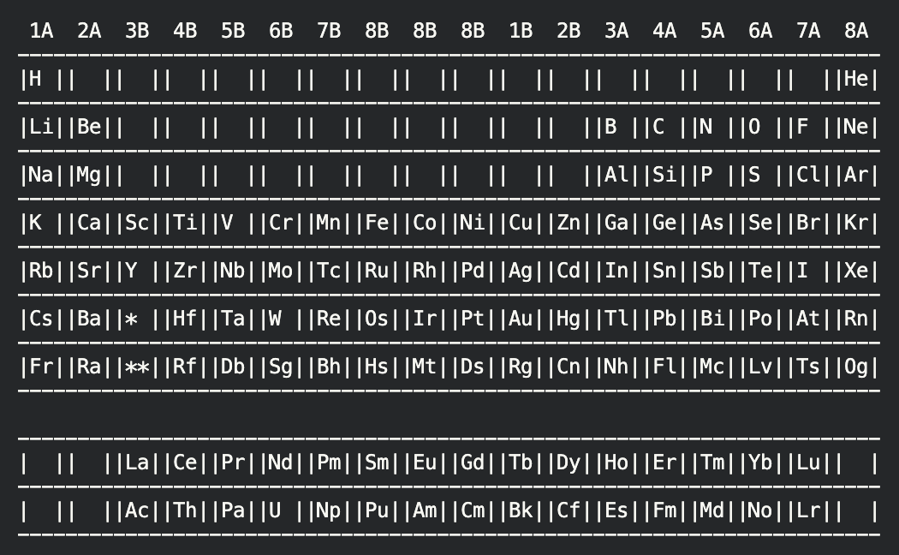

### Hi there 👋, Barkev Şarklı
#### An ambitious undergraduate student
I'm Barkev from Turkey, and my current focus is on designing algorithms. I have a strong passion for learning and implementing programming languages, ranging from low-level to high-level. I thrive on challenges and enjoy struggling.

- 🔭 I’m currently working on C: **periodic_table.c**

- 🌱 I’m currently learning Data Visualization on **HarvardX course on edX**

- 🤝 I’m looking for help to enhance my knowledge

- 💬 Feel free to contact me anytime if you have ideas or suggestions for enhancing the code

- 📫 How to reach me **sarklibarkev@gmail.com**

- ⚡ **I love CS50 <3**

<h3 align="left">Connect with me:</h3>

<h3 align="left">Skills:</h3>

           

  

