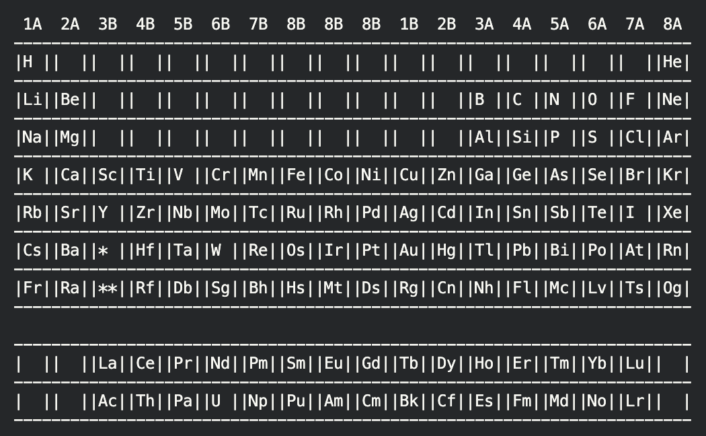

### Hi there 👋, Barkev Şarklı
#### An undergraduate third-year student at Kadir Has University
* #### I am an ambitious undergraduate student pursuing a degree in Computer Engineering and Mechatronics at Kadir Has University.

* ####  I am currently focusing on deep learning by creating my own applications and participating in new online courses.

  - 🔭 I’m currently working on **Python** and **Cpp**

  - 🌱 I’m currently learning Different Deep Learning Algorithms on **Coursera**

  - 🤝 I’m looking for help to enhance my knowledge

  - 💬 Feel free to contact me anytime if you have ideas or suggestions for enhancing the code

  - 📫 How to reach me **sarklibarkev@gmail.com**

  - ⚡ **I love CS50 <3**

<h3 align="left">Connect with me:</h3>

<h3 align="left">Skills:</h3>

  
